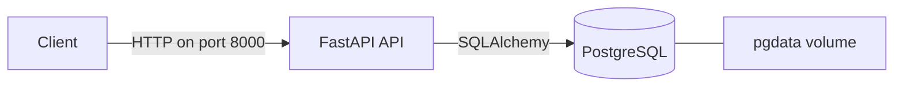

# Uptime Monitor

A backend service that watches websites and reports when they go down. Users register, add the URLs they care about, and the system checks them on a schedule.

This is a learning project built to practice backend system design end to end: API design, data modelling, containers, background processing, monitoring, and cloud deployment.

## Status

Phase 1 is complete: a containerized REST API with authentication, monitor management, database migrations, and an automated test suite. Background checks, alerting, monitoring, and AWS deployment are on the roadmap below.

## Tech stack

| Layer | Tool |
|---|---|
| API | FastAPI, Uvicorn |
| Database | PostgreSQL 16, SQLAlchemy 2, Alembic |
| Auth | JWT (PyJWT), Argon2 password hashing (pwdlib) |
| Tests | pytest |
| Infrastructure | Docker, Docker Compose |

## Architecture



The API is stateless: all data lives in PostgreSQL, so the API container can be replaced or replicated freely. The two containers talk over a private Docker network, and only the API port is published.

## Getting started

Requirements: Docker and Docker Compose.

```bash
git clone https://github.com/Einsteinodi/uptime-monitor.git
cd uptime-monitor
cp .env.example .env
```

Generate a secret key and set it as `SECRET_KEY` in `.env`:

```bash
openssl rand -hex 32
```

Start the services and create the database tables:

```bash
docker compose up --build -d
docker compose run --rm api alembic upgrade head
```

The interactive API docs are at http://localhost:8000/docs.

## Running the tests

```bash
docker compose exec api pytest -v
```

Tests run against a separate `uptime_test` database, so they never touch development data.

## API overview

| Method | Path | Description | Auth |
|---|---|---|---|
| GET | `/health` | Service and database health | No |
| POST | `/auth/register` | Create an account | No |
| POST | `/auth/login` | Get an access token | No |
| GET | `/auth/me` | Current user | Yes |
| POST | `/monitors` | Add a URL to monitor | Yes |
| GET | `/monitors` | List your monitors (paginated) | Yes |
| GET | `/monitors/{id}` | Get one monitor | Yes |
| PATCH | `/monitors/{id}` | Update a monitor | Yes |
| DELETE | `/monitors/{id}` | Delete a monitor | Yes |

## Design decisions

- **Ownership enforced in the query.** Every monitor lookup filters by both monitor ID and user ID, so one user can never reach another's data.
- **404 instead of 403 for other users' monitors.** The API does not reveal which IDs exist.
- **Passwords hashed with Argon2.** Plain passwords are never stored or returned.
- **Stateless JWT authentication.** No server-side session storage, which keeps the API easy to scale horizontally.
- **Schema changes through migrations.** Alembic versions every change, so any environment can be rebuilt to the same schema.

## Project structure

```
app/
├── main.py           # FastAPI app and router registration
├── config.py         # Settings from environment variables
├── database.py       # Engine, session, and base model
├── security.py       # Password hashing and JWT helpers
├── dependencies.py   # Shared dependencies (current user)
├── models/           # SQLAlchemy tables
├── schemas/          # Request and response shapes
└── routers/          # Endpoints
alembic/              # Database migrations
tests/                # pytest suite
```

## Roadmap

- [x] Phase 1: REST API, auth, monitor CRUD, migrations, tests
- [ ] Phase 2: Scheduled uptime checks with Celery and Redis
- [ ] Phase 3: Alerts with retries
- [ ] Phase 4: Metrics and dashboards with Prometheus and Grafana
- [ ] Phase 5: AWS deployment and CI/CD with GitHub Actions
- [ ] Phase 6: Multiple workers, load testing, and a write-up of findings

## License

MIT